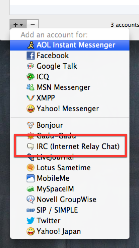
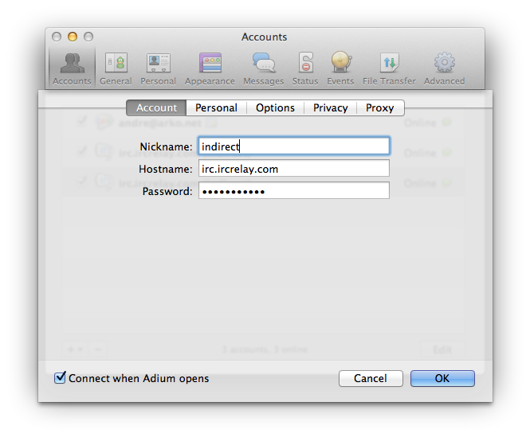
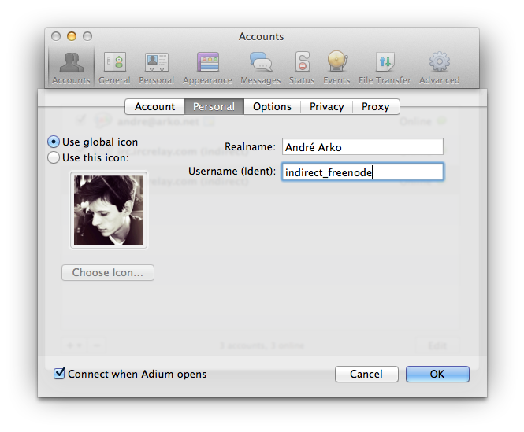
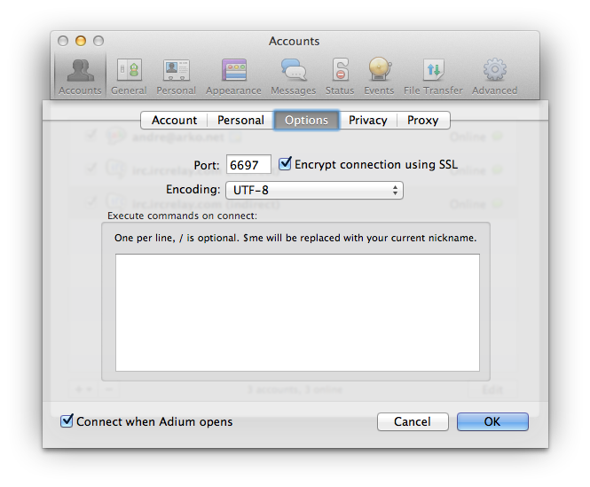

## Adium IRCRelay Set-up Guide

### You should probably get it before you set it up

Download Adium from [adium.im](http://adium.im).

### Adding each server

For each IRC Relay server that you want to add to Adium, open the Preferences dialogue, go to the Accounts tab, and follow these steps:

1. Choose to add a new IRC account.

2. Provide your IRC nick, the hostname, and your IRC Relay account password.

3. Provide your real name, if you want, and your IRC Relay account nickname.

4. Set the port number and enable SSL.

That's it. Push OK, and Adium will connect you to IRC.

To configure your IRC Relay account settings, choose "New chat…" from the "File" menu, and then create a new chat from your IRC account to "*status". I suggest starting with the message "help".

To join a channel, use the "Join Group Chat…" menu item in the "File" menu.

### Support

If you're having trouble, please visit the [support](https://www.ircrelay.com/support) page.
